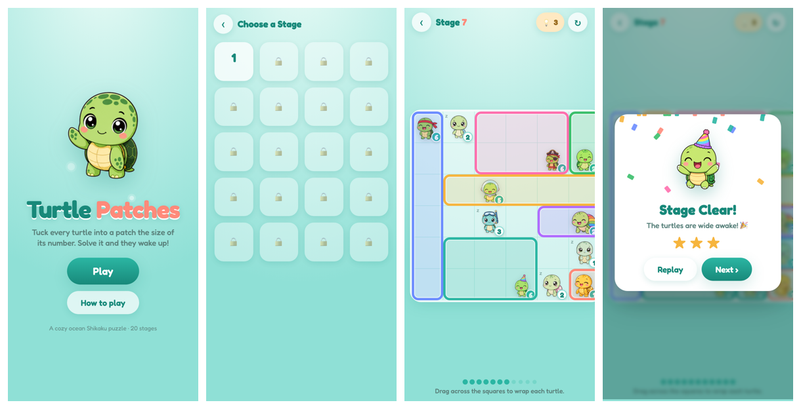

# Turtle Patches 🐢



A cozy ocean **Shikaku** puzzle. Wrap every sleepy turtle in a patch the size of its
number — fill the board with no overlaps and the turtles wake up!

- 20 hand-generated stages with **verified unique solutions** (`scripts/gen_levels.mjs`)
- Drag to draw patches, tap to remove, 💡 hints, star ratings, progress saved locally
- Cute turtle art generated with OpenAI gpt-image (`scripts/gen_art.sh`) and cut out with `scripts/process_art.py`
- Pure static site — no build step

## Run locally
```bash
python3 -m http.server 4173   # then open http://localhost:4173
```

## Deploy
```bash
vercel deploy --prod
```
